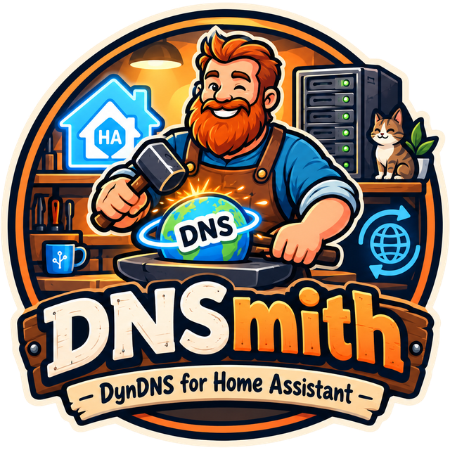

<div align="center">



<h2>Über 60 DNS-Anbieter, eine Oberfläche – direkt in Home Assistant, ganz ohne YAML.</h2>

[![Home Assistant Add-on][addon-badge]][addon-url]
[![Version][version-badge]][version-url]
[![Lizenz][license-badge]][license-url]
[![Prüfungen][checks-badge]][checks-url]

[addon-badge]: https://img.shields.io/badge/Home%20Assistant-Add--on-41BDF5.svg?style=for-the-badge&logo=homeassistant&logoColor=white
[addon-url]: https://www.home-assistant.io/addons/
[version-badge]: https://img.shields.io/badge/dynamic/yaml?url=https%3A%2F%2Fraw.githubusercontent.com%2Fduczz%2Fha-dnsmith%2Fmain%2Fdnsmith%2Fconfig.yaml&query=%24.version&label=version&color=22c55e&style=for-the-badge&logo=github&logoColor=white
[version-url]: https://github.com/duczz/ha-dnsmith/releases
[license-badge]: https://img.shields.io/badge/license-MIT-22c55e.svg?style=for-the-badge
[license-url]: LICENSE
[checks-badge]: https://img.shields.io/github/actions/workflow/status/duczz/ha-dnsmith/checks.yml?branch=main&label=pr%C3%BCfungen&style=for-the-badge&logo=githubactions&logoColor=white
[checks-url]: https://github.com/duczz/ha-dnsmith/actions/workflows/checks.yml

[](https://my.home-assistant.io/redirect/supervisor_add_addon_repository/?repository_url=https%3A%2F%2Fgithub.com%2Fduczz%2Fha-dnsmith)

</div>

---

Dein Anschluss bekommt regelmäßig eine neue IP-Adresse, deine Domains sollen
trotzdem auf ihn zeigen. Bisher heißt das: pro Anbieter eine eigene App oder
ein Skript, jedes mit eigener Konfiguration. DNSmith ersetzt das durch **einen
Hub** — einmal installieren, Anbieter aus einer Liste wählen, Zugangsdaten
eintragen, fertig. Beliebig viele Einträge über beliebig viele Anbieter, alles
über die Oberfläche, keine YAML-Datei.

> **Stand:** läuft, der Katalog umfasst 64 Anbieter. Auf
> echter Hardware erprobt sind die einfachen Anbieter; die Signatur- und
> Zwei-Schritt-APIs sind gegen aufgezeichnete Antworten getestet, nicht gegen
> echte Konten.

---

## ✨ Funktionen

- **🗂️ 64 Anbieter** – von DuckDNS und Dynu bis Cloudflare, Route 53, Google
  Cloud DNS und Aliyun. Je eine erzeugte Anbieterseite unter
  [`docs/providers/`](docs/providers/).
- **🧩 Zwei generische Einträge** – **Generisches DynDNS2** für jeden Dienst,
  der das klassische Protokoll spricht, und ein **eigener HTTP-Provider**, bei
  dem Methode, Authentifizierung, Parameternamen und Erfolgskriterium frei
  einstellbar sind. Damit lässt sich auch anbinden, was nicht in der Liste steht.
- **📄 Ein Anbieter ist eine Datei, kein Programm** – was ein Dienst technisch
  verlangt, steht als Daten in einem Manifest. Daraus entstehen das Formular in
  der Oberfläche, die Anbieterseite in der Dokumentation und der Aufruf selbst.
  54 der 64 Anbieter brauchen keine Zeile Python.
- **🌐 IPv4 und IPv6 gleichberechtigt** – ein Eintrag pflegt A, AAAA oder
  beides. Bei anbieterseitig getrennten Aufrufen erfolgt je Adressfamilie einer.
- **📡 Vier IP-Quellen je Adressfamilie** – automatisch übers Internet, **aus
  einer Home-Assistant-Entität** (der Regelfall bei DS-Lite), feste Adresse,
  oder gar nicht. Liefert eine Entität keinen brauchbaren Wert, bleibt der
  Eintrag unangetastet statt falsch gesetzt zu werden.
- **🩺 CGNAT- und DS-Lite-Erkennung** – die Oberfläche sagt, warum der Anschluss
  trotz erfolgreichem Update nicht erreichbar ist, statt dich Ports prüfen zu lassen.
- **🔌 Verbindung testen** – wo die API es zulässt, ein echter lesender Aufruf
  gegen den Anbieter; wo nicht, steht ausdrücklich „nur Einstellungen geprüft".
- **💬 Fehler mit nächstem Schritt** – statt „HTTP 401" steht dort, was
  abgelehnt wurde und was zu prüfen ist. Die Originalmeldung bleibt aufklappbar.
- **⏱️ Schonender Umgang mit Anbietern** – aktualisiert nur bei tatsächlicher
  IP-Änderung, mit Abklingzeit und Backoff. Sperren werden erkannt und abgewartet.
- **🔒 Kein offener Port** – die Oberfläche läuft ausschließlich über Ingress.
- **🛡️ Kein Sprungbrett ins Heimnetz** – jede vom Nutzer angegebene Adresse
  wird vor dem Aufruf aufgelöst und geprüft; Weiterleitungen werden nicht verfolgt.

---

## 📋 Voraussetzungen

| | |
|---|---|
| **Home Assistant** | eine Installation mit Supervisor (Home Assistant OS oder Supervised) — nur dort gibt es Apps |
| **Architektur** | `aarch64` oder `amd64`. 32-Bit (`armv7`, `armhf`) unterstützt die Home-Assistant-Basis nicht mehr |
| **Konto beim DDNS-Anbieter** | mindestens eines, mit den jeweiligen Zugangsdaten |
| **Für IPv6** | Docker in Home Assistant muss IPv6 haben — ab Mitte 2025 voreingestellt, sonst einmalig `ha docker options --enable-ipv6=true` und Host-Neustart |

Es gibt **kein** veröffentlichtes Image: die App wird beim Installieren auf
deinem Gerät gebaut. Das dauert beim ersten Mal einige Minuten.

---

## 📦 Installation

### Als App-Repository (empfohlen)

1. **Einstellungen → Add-ons → Add-on Store → ⋮ → Repositories**
2. `https://github.com/duczz/ha-dnsmith` hinzufügen
3. DNSmith in der Liste suchen, **Installieren**, dann **Starten**
4. **Öffnen** — die Oberfläche erscheint in der Seitenleiste

Der Knopf oben in dieser Datei erledigt Schritt 1 und 2 auf einmal.

### Manuell

1. Den Ordner `dnsmith` nach `/addons/dnsmith` auf dem Home-Assistant-Gerät
   legen (Samba, SSH oder Studio Code Server)
2. **Einstellungen → Add-ons → Add-on Store → ⋮ → Nach Updates suchen**
3. DNSmith unter „Lokale Add-ons" installieren und starten

> [!WARNING]
> **Beim Aktualisieren den Ordner ersetzen, nicht überkopieren.** Warum das
> einen Unterschied macht, steht im
> [Handbuch](dnsmith/DOCS.md#aktualisieren).

---

## ⚡ Erste Schritte

**Öffnen** → **+ Anbieter hinzufügen** → Zugangsdaten eintragen →
**Verbindung testen** → **Eintrag anlegen**.

Es gibt keine App-Konfiguration im Supervisor-Reiter und keine YAML-Datei —
alles steht in der Oberfläche. Wie die einzelnen Schritte aussehen, woher die
IP-Adressen kommen und was bei IPv6 zu beachten ist, steht im
[Handbuch](dnsmith/DOCS.md#einrichten).

---

## ⚙️ Wie ein Anbieter aussieht

```yaml
engine:
  adapter: native
  protocol: dyndns2
request:
  url: https://api.dynu.com/nic/update
  params:
    hostname: "{hostname}"
    myip: "{ipv4}"
    myipv6: "{ipv6}"
  success:
    vocabulary: dyndns2
```

Das ist der vollständige Dynu-Anbieter. Kein Python dazu.

Zehn der 64 brauchen ein Modul, weil ihre API etwas verlangt, das sich nicht
als ein Aufruf hinschreiben lässt — eine Sitzung, eine Signatur, ein Warten auf
eine Aktion. Warum, steht jeweils im Kopf des Moduls; ein Modul ohne gültigen
Grund gehört zurück ins Manifest.

Auch zwei Schritte bleiben Daten: `lookup:` bindet Zone- und Record-IDs, bevor
`request:` schreibt. Das ist der Unterschied zwischen einem Projekt mit zwanzig
fast gleichen Modulen und einem mit zehn verschiedenen.

Genau eine Abhängigkeit geht auf einen einzelnen Anbieter zurück:
`cryptography`, weil Google Cloud DNS einen RS256-signierten JWT verlangt und
RSA nicht in der Standardbibliothek steht. Route 53 und Aliyun signieren mit
`hmac` und `hashlib` und brauchen nichts.

---

## 🔐 Zugangsdaten und Sicherheit

Zugangsdaten liegen getrennt von der Konfiguration, erscheinen in keiner
Antwort der Oberfläche und in keinem Protokoll, und sind im Export
standardmäßig nicht enthalten. Kein `host_network`, kein `privileged`, kein
veröffentlichter Port, eigenes AppArmor-Profil. Keine vom Nutzer angegebene
Adresse darf ins lokale Netz zeigen.

Wo was liegt, warum nichts verschlüsselt ist und was das für Sicherungen
bedeutet: [Handbuch → Zugangsdaten](dnsmith/DOCS.md#zugangsdaten).
Schwachstellen bitte nicht als öffentliches Issue melden, sondern über
[GitHub Security Advisories](https://github.com/duczz/ha-dnsmith/security/advisories/new).

---

## 📚 Dokumentation

| Dokument | Zielgruppe |
|---|---|
| [Handbuch](dnsmith/DOCS.md) | Nutzer: Einrichten, IP-Quellen, IPv6, Fehlersuche — erscheint auch im App-Reiter „Dokumentation" |
| [Anbieterseiten](docs/providers/) | Nutzer: was ein bestimmter Anbieter verlangt (erzeugt) |
| [Anbieter beitragen](dnsmith/providers/README.md) | Entwickler: Aufbau eines Manifests |
| [Testsuiten](tests/README.md) | Entwickler: was womit abgesichert ist |
| [CHANGELOG.md](dnsmith/CHANGELOG.md) | alle Versionen |

---

## 🧪 Entwickeln

```bash
bash tests/run.sh                 # alle Suiten
bash scripts/test-build.sh        # baut das Image und prüft es (Docker/WSL)
```

Kein pytest: die Suiten sollen auf einem nackten Python laufen. Drei der fünf
brauchen nur PyYAML und jsonschema und sichern genau den Teil ab, den man beim
Hinzufügen eines Anbieters anfasst; die beiden übrigen fahren den Hub hoch und
überspringen sich, wenn seine Abhängigkeiten fehlen.

Kein Test spricht mit einem echten Anbieter.

### Einen Anbieter hinzufügen

1. `dnsmith/providers/src/<id>.yaml` schreiben — das ist die Quelle
2. `python3 tools/manifest_merge.py` erzeugt das Manifest und prüft es. Jeder
   Platzhalter im `request`-Block muss von einem Formularfeld, einem
   Laufzeitwert oder einer `lookup`-Bindung gedeckt sein; sonst schlägt es fehl
3. `python3 tools/gen_docs.py` erzeugt die Anbieterseite
4. Den Endpunkt in `tests/test_provider_requests.py` eintragen — die Tabelle
   dort ist absichtlich eine zweite Kopie von Host und Pfad

---

## 🗂️ Aufbau

```
dnsmith/                 was auf das Gerät kommt
  hub/                   Python: Oberfläche, Konfiguration, Zugangsdaten, Updates
  providers/             Manifeste (erzeugt) und src/ (Quelle)
  frontend/              die Ingress-Oberfläche
docs/providers/          Anbieterseiten (erzeugt)
schemas/                 das Manifest-Schema
tools/                   Erzeuger und Prüfwerkzeug
tests/                   die Testsuiten
```

Ein Prozess, ein Container. Schlägt ein Update fehl, betrifft das nur den einen
Eintrag: die Oberfläche bleibt erreichbar und zeigt den Grund.

---

## 🆘 Hilfe

- **Fehlersuche:** die häufigen Fälle stehen in
  [`dnsmith/DOCS.md`](dnsmith/DOCS.md#fehlersuche)
- **Protokoll:** Einstellungen → Add-ons → DNSmith → **Protokoll**. Für mehr
  Details die Protokollstufe in den DNSmith-Einstellungen auf `debug` stellen —
  Zugangsdaten werden auch dort herausgefiltert
- **Fehler melden:** [Issue anlegen](https://github.com/duczz/ha-dnsmith/issues/new/choose)
- **Sicherheitslücke:** [GitHub Security Advisories](https://github.com/duczz/ha-dnsmith/security/advisories/new), nicht als öffentliches Issue

---

## 📄 Lizenz

MIT — siehe [LICENSE](LICENSE). Hinweise zu Anbieter-Icons und Marken stehen in
[NOTICE](NOTICE).
